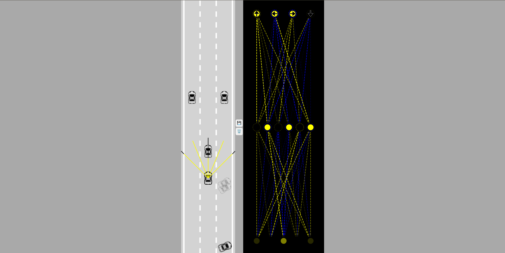

# Trabalho Final Lógica de Programação

## Situação problema:

Uma empresa gostaria de implementar um sistema de direção automática em seus carros. Entretanto, eles precisam de uma prova de conceito para levar a ideia adiante. Seu objetivo como desenvolvedor será criar um modelo simples, que exiba como essa ideia poderia ser implementada na prática. 

## Solução implementada:

Foi implementada um modelo virutal  que funciona da seguinte maneira:

Temos uma estrada reta.

Temos três carros do tipo "AUTO" que se movimentam de maneira automática para frente, constituindo tráfego.

E temos 100 carros do tipo "IA"  a cada carregamento da página.

Carros do tipo "IA", ou inteligência artificial são dotados de sensores, que nada mais são do que retas traçadas a partir do centro do veículo que detectam colisão com outros objetos (a saber as extremindaddes da estrada e outros carros), quado os intersectam.

Carros "IA" são controlados de maneira aleatória através de um algoritmo que gera números entre -1 e 1, os quais são usados para decidir se as direções para frente, para trás, para direita e para a esquerda serão ativadas.

Naturalmente o sucesso dessa ativação aleatória é baixa, por isso:

1. 100 carros são gerados simultaneamente

2. Temos um critério para determinar qual o melhor controle (simplesmente aquele que vai mais longe no eixo Y)

3. Temos um botão que salva o melhor controle da última iteração para ser utilizado na próxima

4. Temos um algoritmo para mutar cada iteração com base na anterior tentando encontrar resultados superiores.

## Código

O código foi construído utilizando o estilo orientado a objetos, sendo organizado majoritariamente em classes.

Ele também foi quebrado nos seguintes arquivos:

- index.html

Onde os diversos arquivos script são importados, os canvas são criados e o css é importado. 

- style.css

Onde os estilos foram definidos 

- main.js 

Responsável por ser a "porta de entrada" do programa, onde chamamos todas as classes relevantes e os métodos para desenhar e animar os componentes do código.

- carro.js

Responsável por definir os carros, independentemente dos seus tipos. Inclui por exemplo, sua altura, largura, velocidade, aceleração, atrito, se foi danificado ou não e como se movimenta.

- controle.js

Não teve uso substancial na versão final, mas durante o processo de implementação foi utilizado para que eu pudesse controlar o carro com o teclado. É uma classe muito simples que controla os valores da direção do carro (que são booleanos) utilizando eventos do teclado.

- estrada.js

Define a estrada, seus limites, assim como as características necessárias para que possamos detectar a colisão com as suas laterias. Alguns métodos importantes como para o posicionamento correto dos carros nas faixas também foram implementados aqui. 

- sensor.js

Responsável por projetar raios a partir do carro para que possamos detecatar a colisão (interseção) com objetos que foram supostos ser sólidos, como outros carros e os limites da estrada.

- rede.js

Possui duas classes RedeNeural e Nivel. Nessa implementação, uma rede neural é simplesmente um array de níveis e os níveis definem simplesmente as entradas saídas e pesos da nossa rede neural. A rede por sua vez conta com métodos para passar saídas de um nível como entradas para outro níveis e uma função mutar que nos permite gerar variações quão grandes ou pequenas nós quieramos nos carros criados.

- utils.js

Conta com funções que são utilizadas em vários arquivos, elas são para o cálculo de interpolação linear, cálculo de intersecção entre pontos e polígonos.

- visualizador.js

É a classe que nos permite visualizar a rede neural do carro com melhor adequação em tempo real.

## Sobre o código

Como o projeto foi bastante complexo ele foi exaustivamente comentado. Sugere-se a leitura do código fonte para um melhor entendimento. 

## Como utilizar o programa

Ao abrir o *index.js* no navegador 100 instâncias de carros com inteligência artificial serão criadas. Do lado direito da tela é possível visualizar o funcionamento da rede neural do carro mais adequado, que nessa implementação se refere simplesmente ao carro com maior valor em y. 

Este carro também será o único carro que não faz parte do tráfego é não está semi-transparente.

Você pode clicar no botão com o disquete para salvar o resultado do melhor carro desse carregamento para ser utilizado como entrada para a função de mutação quando a página for recarregada.

Além disso, o botão com a lixeira pode ser utilizado para apagar esse resultado e retomar o programa para um estado completamente randômico.

## Verificando o desenvolvimento

Como esse trabalho foi feito através do github, todo o desenvolvimento e os estados parciais podem ser vistos no histórico desse repositório.

## Imagem do funcionamento

